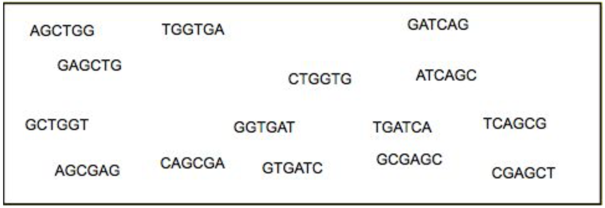
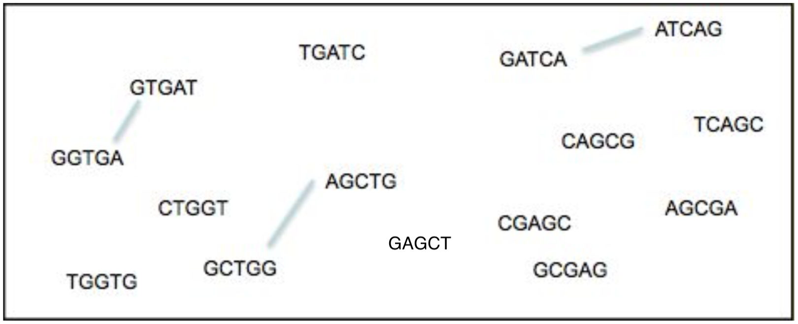
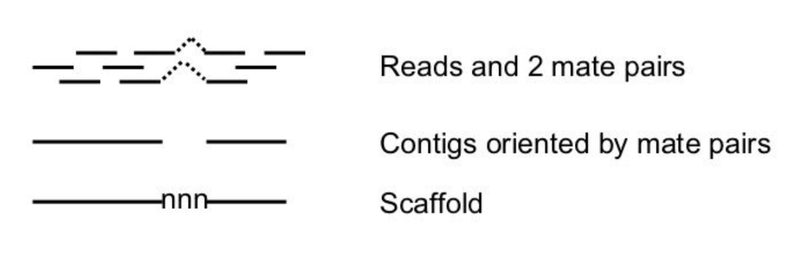
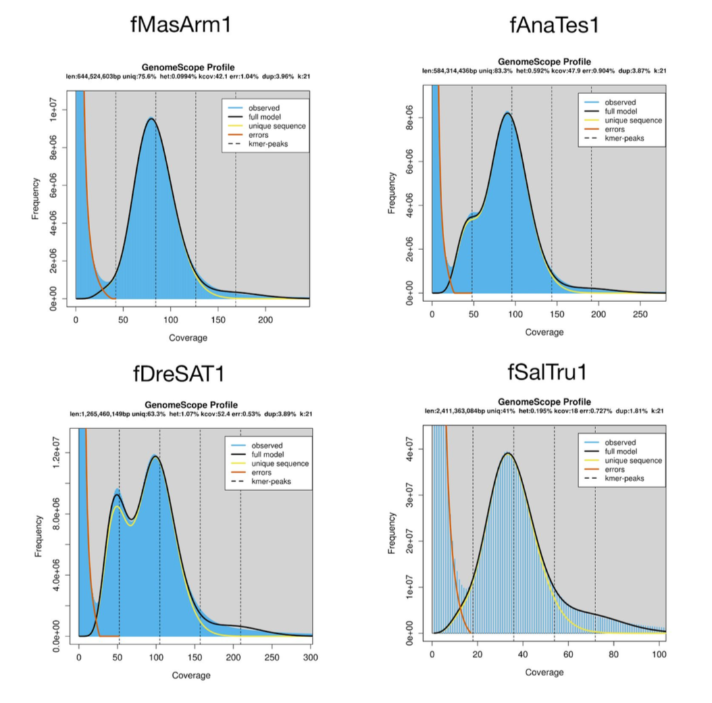

# Module 8: Genome assembly exercises

In this module we will look at one chromosome of the lab strain of *Plasmodium falciparum*, the IT clone. We have sequenced the genome with PacBio and Illumina and pre-filtered to reads to those from a single chromosome.

## A: Starting the PacBio de novo assembly

First, we are going to start the PacBio assembly using the `canu` program. It first corrects the reads and then uses the Celera assembler to merge the long reads into contigs.

* Navigate to the data directory (`cd ~/course_data/assembly/data/`)

* The pre-filtered PacBio reads are called `PBReads.fastq.gz` - have a look at the contents of this file (`zless -S PBReads.fastq.gz`). What do you notice compared to the Illumina fastq files you have seen earlier in the week?

* Now we will start the assembly with canu (https://canu.readthedocs.io/). **NOTE: This will take some time, so we will start it running now in the background and hopefully it will complete while we work on the other exercises.**

```
canu -p PB -d canu-assembly -s file.specs -pacbio-raw PBReads.fastq.gz &> canu_log.txt &
```

The `-p` option sets the prefix of output files to `PB`, while the `-d` option sets the output directory to `canu-assembly/`. The `&` at the end will set this command running in the background while you work on the following sections.

Before we move on, let’s just make sure the program is indeed running. Using the ‘top’ or better `htop` command will show you all processes running on your machine (type `q` to exit top). You should hopefully see processes associated with canu running (maybe something called `meryl`). We can also check the `canu_log.txt` file where the canu logs will be written. If we see error messages in there, then something has gone wrong.

## B: Doing a de Brujin graph by hand

Here we are going to do an example of making the de Brujin graph by hand! Build the graph from the reads and find the contig(s).



Use a *k*-mer value of `k=5`, we get the following *k*-mers from these reads. To finish the graph, join *k*-mers that overlap by 4 bases.



* **What is the contig sequence?**

* **What was tricky here?**

* **Where does the contig start?**


## C: Making an Illumina assembly

We are now going to use the assembler `velvet` (https://www.ebi.ac.uk/~zerbino/velvet/) to assemble the Illumina reads. Our Illumina reads are from the same sample we used to generate the PacBio data.

To start:

```
velveth k.assembly.49 49 -shortPaired -fastq IT.Chr5_1.fastq IT.Chr5_2.fastq
```

`49` is the *k*-mer size. `k.assembly.49` is the name of the directory where the results are going to be written. The other options specify the type of the input data (`-shortPaired`). With the following command you can see all possible options, but don’t be afraid, not all must be used.

```
velveth
```

Now the assembler has to build the graph and find the path, as we did manually above. This is done using `velvetg` rather than `velveth`:

```
velvetg k.assembly.49 -exp_cov auto -ins_length 350
```

The first parameter specifies the working directory as created with the `velveth` command. The second is to let `velvet` find the median read coverage rather than specifying it yourself. Last, the insert size of the sequencing library is given. There is a lot of output printed to the screen, but the most important is in the last line:

```
Final graph has 1455 nodes and n50 of 7527, max 38045, total 1364551, using 700301/770774 reads.
```

**(Your exact result might differ depending on the velvet version used - don’t worry).**

This line first gives you a quick idea of the result. 1455 nodes are in the final graph. An **n50** of 7527 means that 50% of the assembly is in contigs of at least 7527 bases, it is the median contig size. This number is most commonly used as an indicator of assembly quality. The higher, the better! (but not always!) **Max** is the length of the longest contig. **Total** is the size of the assembly, here 1346kb. The last two numbers tell us how many reads were used from the 7.7 million pairs.

That wasn’t too bad! Now we have to try to improve the assembly a bit. The *k*-mer size has the biggest impact on assembly results. The `-cov_cutoff` parameter can play a role. This means that nodes with less than a specific *k*-mer count are deleted from the graph. More parameters can be changed, but we would run out of time. In the beginning the changes look a bit random, but with more experience, you will get a feeling for them.
			
First rerun velvet with a *k*-mer size of 49. As parts of the graph are already done, the program will run far quicker now. velveth doesn’t need to be rerun.

```
velvetg k.assembly.49 -exp_cov auto -ins_length 350 -min_contig_lgth 200 -cov_cutoff 5
```

Make a few other assemblies for different *k*-mer sizes i.e. 55, 41, here the example is a *k*-mer length of 55.

```
velveth k.assembly.55 55 -shortPaired -fastq IT.Chr5_1.fastq IT.Chr5_2.fastq

velvetg k.assembly.55 -exp_cov auto -ins_length 350 -min_contig_lgth 200 -cov_cutoff 5
```

* **Write down the results for each assembly made using different *k*-mer sizes. Which one looks the best?**


| *k*-mer | nodes | n50 | largest contig |
| --------|:-----:|:----:| :-------------:|
| 41      |       |     |                |
| 49      |       |     |                |
| 55      |       |     |                |


If you want to play with other parameters, like the `-min_pair_count`, go for it. All the options can be seen by typing:

```
velvetg
```

All the results are written into the directory you specified, e.g. `k.assembly.49`. The final contigs are in `contigs.fa`. The `stats.txt` file holds some information about each contig, its length, the coverage, etc. The other files contain information for the assembler.

Another way to get more stats from all the runs is to use a little program called `assembly-stats`. It displays the number of contigs, the mean size and a lot of other numbers. It might help to pick “the best” assembly		 

Just type:

```
assembly-stats k.assembly*/*.fa
```

**EXAMPLE ONLY - YOUR NUMBERS WILL DIFFER!**

```
stats for k.assembly.41/contigs.fa
sum = 1435372, n = 199, ave = 7212.92, largest = 75293
N50 = 22282, n = 19
N60 = 16569, n = 27
N70 = 13251, n = 37
N80 = 9535, n = 49
N90 = 4730, n = 69
N100 = 202, n = 199
N_count = 51974
-------------------------------
stats for k.assembly.49/contigs.fa
sum = 1452034, n = 175, ave = 8297.34, largest = 85317
N50 = 28400, n = 17
N60 = 26582, n = 23
N70 = 16485, n = 29
N80 = 12065, n = 39
N90 = 6173, n = 55
N100 = 202, n = 175
N_count = 57000
-------------------------------
stats for k.assembly.55/contigs.fa
sum = 1461496, n = 181, ave = 8074.56, largest = 71214
N50 = 28059, n = 19
N60 = 22967, n = 25
N70 = 14871, n = 33
N80 = 11360, n = 44
N90 = 4885, n = 64
N100 = 205, n = 181
N_count = 69532
```

* **What is the best choice for k?**

The `n50`, average contig size and the largest contigs have the highest values, while contig number is the lowest. Before we look at the assembly itself, what could the `N_count` mean?


As we discussed before, DNA templates can be sequenced from both ends, resulting in mate pairs. Their outer distance is the insert size. Imagine mapping the reads back onto the assembled contigs. In some cases the two mates don’t map onto the same contig. We can use those mates to scaffold the two contigs e.g. orientate them to each other and put N’s between them, so that the insert size is correct, if enough mate pairs suggest that join. Velvet does this automatically (although you can turn it off). The number of mates you need to join two contigs is defined by the parameter -min_pair_count.
						
Here is the description:
						
```
-min_pair_count <integer>: minimum number of paired end connections to justify the scaffolding of two long contigs (default: 5)
```

Here a schema:



It might be worth mentioning, that incorrect scaffolding is the most common source of error in assembly (so called mis-assemblies). If you lower the `min_pair_count` too much, the likelihood of generating errors increases.

Other errors are due to repeats. In a normal assembly one would expect that the repeats are all collapsed, if they are smaller than the read length. If the repeat unit is smaller than the insert size, than it is possible to scaffold over it, leaving the space for the repeats with N’s.
							
To get the statistic for the contigs, rather than supercontigs, you can use seqtk to break the scaffold at any stretch of N’s with the following commands:

```
seqtk cutN -n1 k.assembly.49/contigs.fa > tmp.contigs.fasta

assembly-stats tmp.contigs.fasta
```

* **How does the contig N50 compare to the scaffold N50 for each of your assemblies?**


## D: What to expect from a genome assembly?

We are lucky with this test dataset in that we have a known reference genome and some expectations about the size and composition of the *P. falciparum* genome. How can we get at this for new genomes we haven’t sequenced before? One way is to look at *k*-mer distributions. Genomescope (http://qb.cshl.edu/genomescope/) will model the single copy *k*-mers as heterozygotes, while double copy *k*-mers will be the homozygous portions of the genome. It will also estimate the haploid genome size.

Let’s check with our *P. falciparum* Illumina data that the *k*-mer distribution gives us what we expect. To get a distribution of 21-mers, we use `jellyfish`:

```
jellyfish count -C -m21 -s2G -t4 -o IT.jf <(cat IT.Chr5_1.fastq IT.Chr5_2.fastq)

jellyfish histo IT.jf > IT.histo
```

Then we analyse with genomescope:

```
Rscript genomescope.R IT.histo 21 76 IT.jf21
```

Where 76 is the read length of our input Illumina data and `IT.jf21` is the output directory. The output is summarised in a `less IT.jf21/summary.txt` file.

* **What is the predicted heterozygosity? What is the predicted genome size? Does this seem reasonable?**

You should also find an image like below (`firefox IT.jf21/plot.png`). Notice the bump to right of the main peak. These are the repeated sequences.

We have some *k*-mer histograms for a handful of other species in the data directory. Try running genomscope on these. Read length for all of these is 150bp.

* **fMasArm1.jf21.histo**: You should see a nice tight diploid peak for this sample. It has very low heterozygosity - similar to human data.

* **fAnaTes1.jf21.histo**: What is the bulge to the left of the main peak here? 

* **fDreSAT1.jf21.histo**: What is the striking feature of this genome?

* **fSalTru1.jf21.histo**: This genome was actually haploid. How do we interpret the features in the genomescope profile?

## E: Back to our PacBio assembly

So our Illumina assembly is ok, but not perfect. Let’s have a look at the PacBio assembly, which should have hopefully finished by now (check the log `less canu_log.txt`).	
						
Now use the assembly-stats script to look at the stats of the assembly.

```
assembly-stats canu-assembly/PB.contigs.fasta
```

* **How does it compare to the Illumina assemblies?**

Another long read assembler based on de Bruijn graphs is `wtdbg2` (https://github.com/ruanjue/wtdbg2). Let’s try to build this assembly too.

```
wtdbg2 -t4 -i PBReads.fastq.gz -o wtdbg

wtpoa-cns -t4 -i wtdbg.ctg.lay.gz -fo wtdbg.ctg.lay.fasta

assembly-stats wtdbg.ctg.lay.fasta
```

* **How does it compare to the Illumina and canu assemblies?**

They may be similar in contig number and N50, but are they really similar? Let’s map the Illumina reads to each, call variants and compare.

```
bwa index canu-assembly/PB.contigs.fasta

samtools faidx canu-assembly/PB.contigs.fasta

bwa mem -t4 canu-assembly/PB.contigs.fasta IT.Chr5_1.fastq IT.Chr5_2.fastq | samtools sort -@4 - | samtools mpileup -f canu-assembly/PB.contigs.fasta -ug - | bcftools call -mv > PB.vcf
```
bwa mem -t4 wtdbg.ctg.lay.fasta IT.Chr5_1.fastq IT.Chr5_2.fastq | samtools sort -@4 - | samtools mpileup -f wtdbg.ctg.lay.fasta -ug - | bcftools call -mv > wtdbg.vcf

Do the same for `wtdbg.ctg.lay.fasta` and then compare some basic stats.

```
bcftools stats PB.vcf | grep ^SN

bcftools stats wtdbg.vcf | grep ^SN
```

* **What do you notice in terms of the number of SNP and indel calls?**


The wtdbg assembly has more variants due to having more errors. This is mainly due to a lack of error correction - something built into the canu assembly pipeline, but not wtdbg2.


##  F: Polishing

Correcting errors is an important step in making an assembly, especially from noisy long ready data. Not polishing can lead to genes not being called due to insertion and deletion errors in the assembly sequence. To polish with the Illumina data we use `bcftools consensus` to change homozygous differences between the assembly and the Illumina data to match the Illumina data:

```
bgzip -c PB.vcf > PB.vcf.gz

tabix PB.vcf.gz

bcftools consensus -i'QUAL>1 && (GT="AA" || GT="Aa")' -Hla -f Pacbio/PB.contigs.fasta PB.vcf.gz > PB.contigs.polished.fasta
```

Map, and variant call like above (`bwa index`/`bwa mem`/`samtools-sort`/`mpileup`/`bcftools call`) using this polished assembly as the reference this time. 

* **When running on this new output, do we still get variants? More or less than with the raw canu and wtdbg2 assemblies? Why?**





